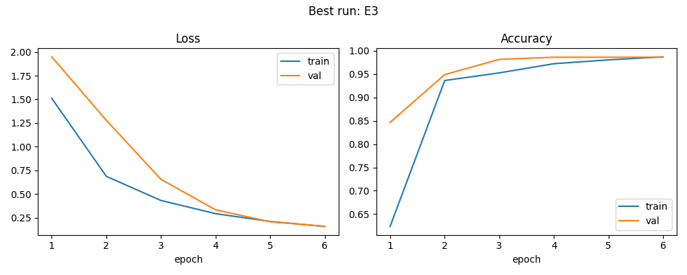
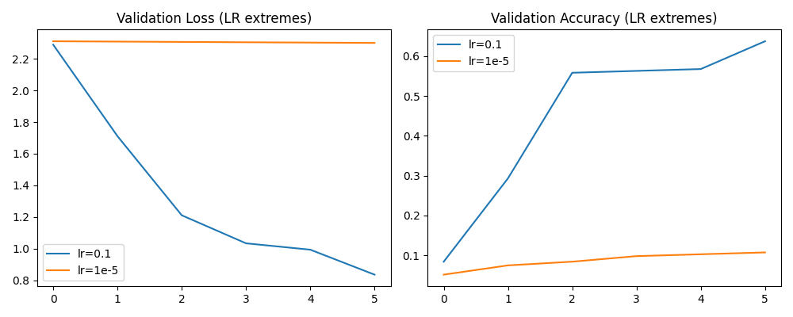

# MLP Training Optimization Report

## 1. Dataset

В работе использовался датасет KMNIST.  
Из-за проблем с загрузкой был использован fallback — sklearn digits.

Характеристики данных:

- размер изображения: 8×8
- количество признаков: 64
- количество классов: 10

Данные были разделены на:

- train
- validation
- test

---

# 2. Модель

Использовалась многослойная нейронная сеть (MLP):

Architecture:

Input → Linear(256) → ReLU → Linear(128) → ReLU → Linear(10)

Функция потерь:

CrossEntropyLoss

---

# 3. Регуляризация

Были протестированы методы регуляризации:

### Dropout
p = 0.3

Используется для предотвращения переобучения.

### Batch Normalization

Нормализация активаций слоя для ускорения обучения и стабилизации градиентов.

### Early Stopping

Останавливает обучение, если validation loss перестает улучшаться.

---

# 4. Эксперименты

Проведены следующие эксперименты:

| id | метод |
|----|------|
| E1 | базовая модель |
| E2 | Dropout |
| E3 | BatchNorm |
| E4 | Dropout + EarlyStopping |

---

# 5. Эксперименты оптимизации

| id | метод |
|----|------|
| O1 | слишком большой learning rate |
| O2 | слишком маленький learning rate |
| O3 | SGD + momentum |

---

# 6. Результаты

Лучшие результаты:

| experiment | accuracy |
|-----------|----------|
| E3 | ~0.986 |
| E4 | ~0.986 |

BatchNorm показал наилучшую стабильность обучения.

---

# 7. Кривые обучения

### Лучший запуск

Модель быстро сходится и достигает высокой точности.

---

### Экстремальные learning rate

- большой learning rate → нестабильное обучение
- маленький learning rate → очень медленная сходимость

---

# 8. Выводы

1. Batch Normalization ускоряет обучение и повышает стабильность модели.

2. Dropout не дал значительного улучшения из-за небольшого размера датасета.

3. Learning rate является критическим гиперпараметром.

4. Adam показал лучшую производительность по сравнению с SGD.

---

# 9. Артефакты

Сохранены:

- runs.csv — таблица экспериментов
- best_model.pt — веса лучшей модели
- best_config.json — конфигурация лучшего запуска
